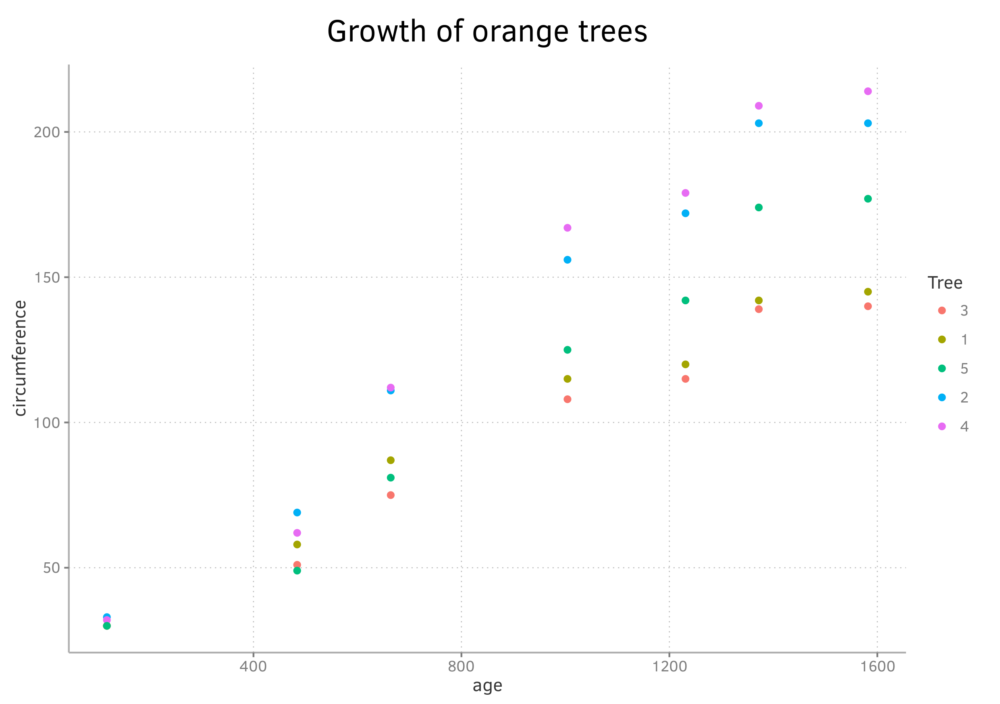
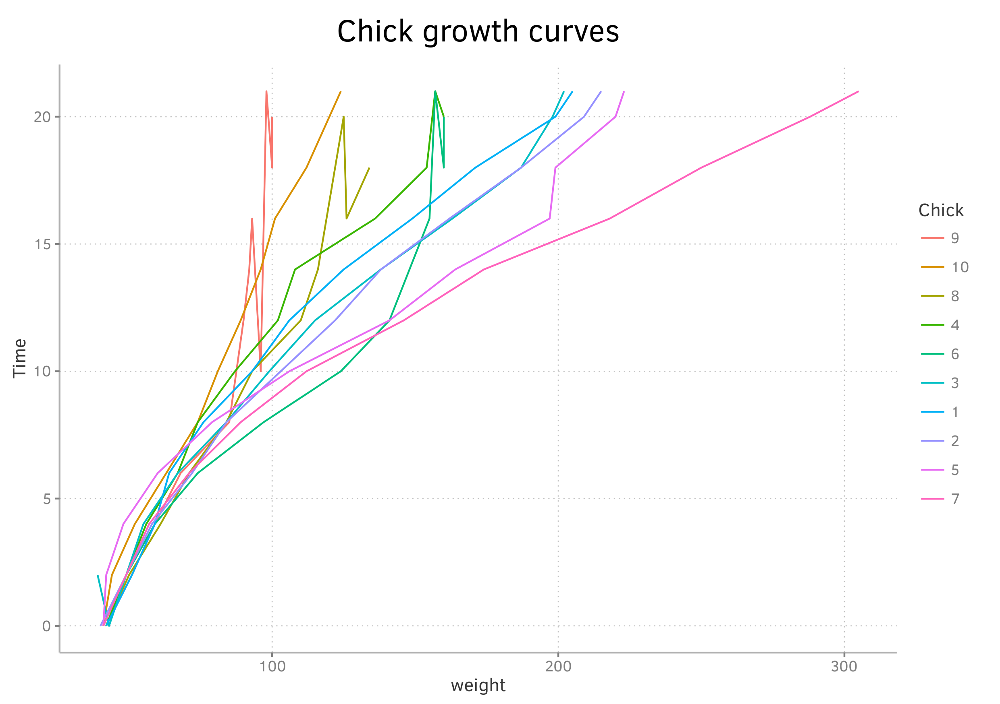
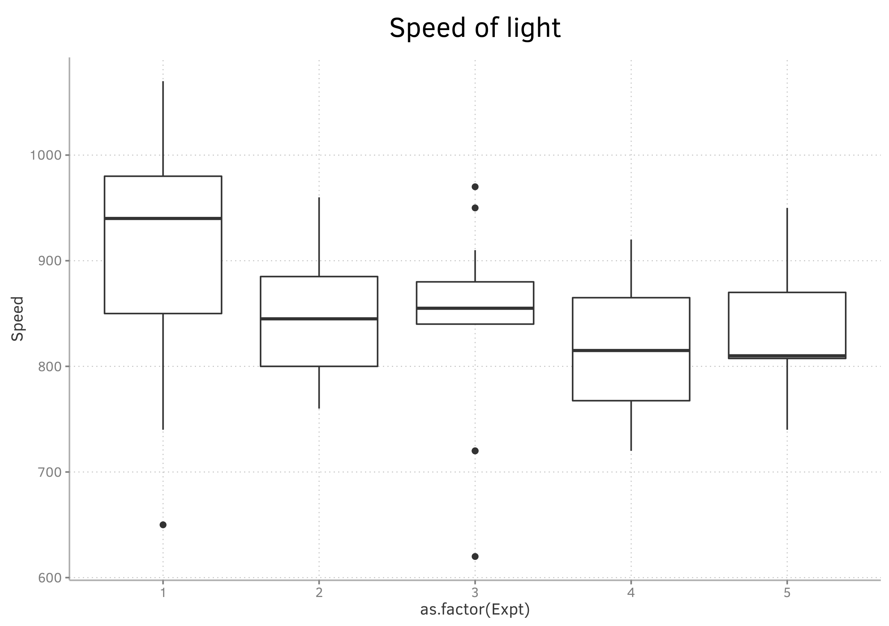

# huggplot

## Minimal working example

First, download the theme from the github repository
```
library(ggplot2)

source('https://raw.githubusercontent.com/Bisaloo/huggplot/master/huggtheme.R')
```

Now, it is time to try out this theme:

### Basic plot

```
ggplot(Orange, aes(age, circumference, colour = Tree)) + geom_point() + huggtheme() + 
  labs(title = 'Growth of orange trees')
```



### Line plot

```
ggplot(ChickWeight[ChickWeight$Chick %in% seq(1:10),], aes(weight, Time, colour = Chick)) + 
  geom_line() + huggtheme() + labs(title = 'Chick growth curves')
```



### Boxplot

```
ggplot(morley, aes(as.factor(Expt), Speed)) + geom_boxplot() + huggtheme() +
  labs(title = 'Speed of light')
```  




